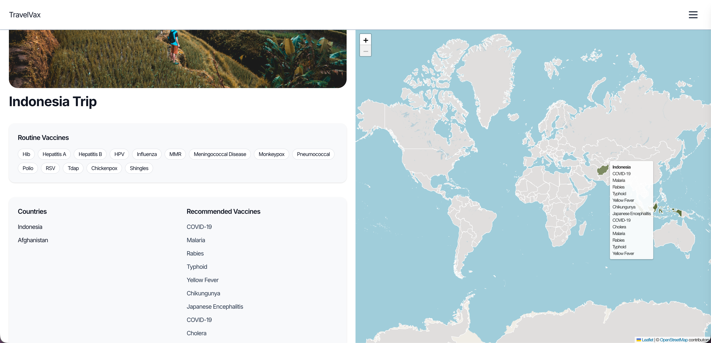

# TravelVax Angular

A rebuild of the TravelVax React frontend in Angular 22, built to learn Angular's component model, services, dependency injection, and routing.

TravelVax helps travelers plan international trips with confidence by providing personalized vaccination recommendations for every destination.

## Why Angular?

I build this project to get hands-on Angular experience. I rebuilt the most basic features of an existing project so I could focus on learning Angular's patterns.

## Live Demo

[travelvax-angular.vercel.app](https://travelvax-angular.vercel.app)

## Tech Stack

- **Angular 22** — components, services, dependency injection, RxJS Observables
- **TypeScript** — interfaces, strict typing throughout
- **Tailwind CSS** — same styling system as the React version for easy comparison
- **RxJS** — Observables for async data fetching via `HttpClient`
- **Vitest** — unit tests for services using `HttpTestingController`

## What's Implemented

- Landing page with background image and call to action
- Itineraries index — fetches from Rails API and displays itinerary cards
- Create itinerary form — POST to Rails API, new card appears without page reload
- Itinerary show page — displays countries, routine vaccines, and destination-specific vaccine recommendations with a map placeholder

## What's Planned (Next Iteration)

- **Interactive map** — the React version uses Leaflet to display an interactive map on the show page (screenshot below). This would be added to Angular using `ngx-leaflet`
- **Authentication** — the React version has full Clerk OAuth + email OTP 2FA. Angular auth is scoped out of this iteration
- **Save itinerary flow** — guest users can create itineraries and save them to their account after signing in

## Architecture

Follows Angular best practices with a clean separation of concerns:

```
src/app/
  components/     # reusable UI components (header, sidebar, itinerary card, form)
  pages/          # routed page components (landing, itineraries, show)
  services/       # HttpClient API calls (itinerary, country)
  interfaces/     # TypeScript data shapes (Itinerary, Country, Vaccine)
  environments/   # environment-specific config (dev vs production API URL)
```

### Interactive Map (React version — planned for Angular)

